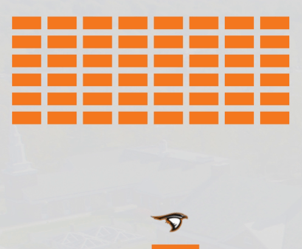

 Soar, Raven, Soar
========================================================

This game is designed to provide several activities for high school students visiting the Anderson University Computer Science department.

This game is available to play live:

https://soar-raven-soar.netlify.com/

Activities
==========

Simple Tweaks
-------------

Various properties of the game can be easily adjusted to change gameplay. For example, any of the following can be easily changed:

- Size of the paddle
- Number of bricks
- Size of bricks
- Size of the Raven hitbox
- Color of bricks and paddle

Sprite Rotation
---------------

The raven currently always faces the same direction. This could be adjusted so that he faces his current direction of travel.

Hint: There's already a flipped version of the raven sprite included in this project named `raven-left.png`.

Security
--------

The value of the difficulty field is currently used in an unsafe way that can allow cheating. The following is one example of this unintended behavior:

- Pause the game
- Enter `ravens_freed=1000` in the difficulty field
- Press `Restart`
- Enter `3` for the difficulty
- Press `Restart`
- Unpause the game
- Note how your score has changed

We should change the way this field is handled to make it more secure.

Clipping
--------

We currently allow very high difficulty values to be set. This breaks gameplay by allowing the Raven to "clip" through objects. Here's one example:

- Set the difficulty to 1000
- Notice that your score now climbs rapidly. This is due to the fact that our basic physics engine was only designed to handle velocities up to a certain limit.
- Try setting the difficulty to 20, pausing the game, and stepping through individual frames to get a better idea of what is happening.

We should limit difficulty to reasonable values to prevent this behavior.

Learn More
==========

The inner workings of this application are based around the Javascript [breakout game tutorial](https://developer.mozilla.org/en-US/docs/Games/Tutorials/2D_Breakout_game_pure_JavaScript) available from Mozilla. Walking through that tutorial step by step will give you a stronger sense for how this game functions.

There are also several other [web game development tutorials](https://developer.mozilla.org/en-US/docs/Games/Tutorials) available from Mozilla if you are ready to go deeper.
